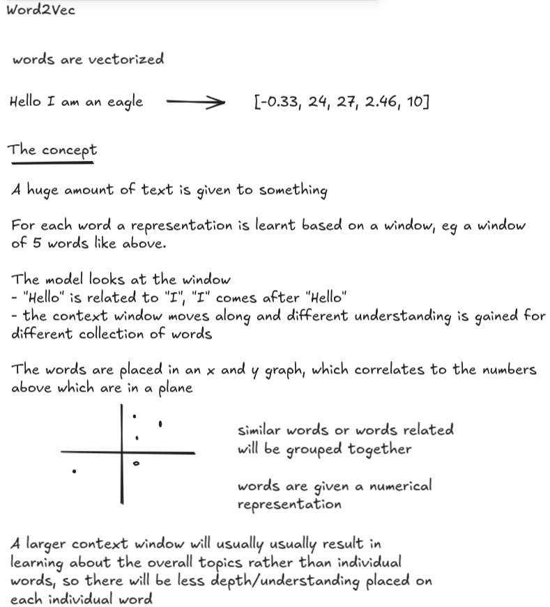

# Job finder

- This tool finds similar jobs by url based on the url passed to the script

```
$ jobe <url for a job description>
```

## What needs to be done

- create a crawler to crawl through a bunch of jobs and scrape content
  - should be generic

- we need to write a script to scrape the job that was input into the terminal

- we need to create embeddings for the entire job corpus
  - the word2vec(doc2vec) model will be pre-trained
  - everything needed will be pre-crawled
    - we are not going to fetch new jobs on inference
    - just look at the data(jobs) saved in the db

- process for finding similar jobs
  - for now cosine similarity

- the db
  - for now will be a big json file

  - [
    {
    url: "https://",
    title: "",
    embedding: []
    }
    ]


